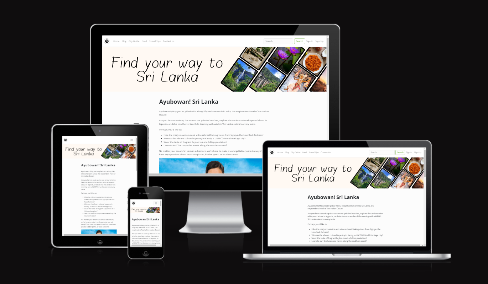
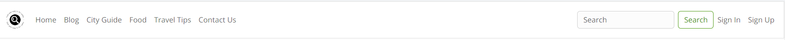
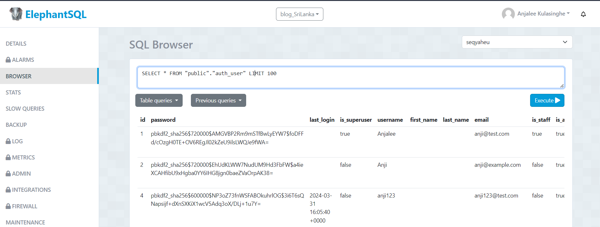

# Anjalee Kulasinghe Online CV

## Code Institute - Fourth Milestone Project: Full-Stack Toolkit Portfolio Project.

This website was developed to showcase my ability to build a Full-Stack site based on business logic used to control a centrally-owned dataset website.

Sri Lanka, the "Pearl of the Indian Ocean," has captivated travelers with its stunning beaches, ancient cultural heritage, and surprising affordability. This blog is created as a gateway to discover Sri Lanka's hidden beauty, from lush rainforests to forgotten temples, with practical tips and insights to craft an unforgettable adventure, all at a budget-friendly price.

# Table of Contents
- [Anjalee Kulasinghe Online CV](#anjalee-kulasinghe-online-cv)
  - [Code Institute - First Milestone Project: User Centric Frontend Development.](#code-institute---first-milestone-project-user-centric-frontend-development)
- [Table of Contents](#table-of-contents)
  - [Demo](#demo)
    - [A live demo to the website can be found here](#a-live-demo-to-the-website-can-be-found-here)
  - [UX](#ux)
  - [User stories](#user-stories)
    - [Strategy](#strategy)
    - [Scope](#scope)
    - [Structure](#structure)
    - [Skeleton](#skeleton)
    - [Surface](#surface)
  - [Technologies](#technologies)
  - [Features](#features)
    - [Existing Features](#existing-features)
    - [Features Left to Implement](#features-left-to-implement)
  - [Testing](#testing)
    - [Validator Testing](#validator-testing)
    - [Bugs](#bugs)
  - [Deployment](#deployment)
  - [Credits](#credits)
    - [Content](#content)
    - [Media](#media)
    - [Acknowledgements](#acknowledgements)

## Demo

### A live demo to the website can be found [here](https://portfolio-project4-blog-5ce2c6935f38.herokuapp.com/)

## UX
There are three user groups targeted by this website. They are admins, registered users, and visitors.
The site is focused on simplicity and ease of navigation for the user's main focus on the blog articles related to Sri Lanka.

## User stories
As the sole developer of this website, my goal is to secure this travel blog, empowering users to create profiles, share their adventures through posts with photos, and interact with each other's content. For deeper exploration, users can search and discover new destinations based on keywords, locations, or trending topics, while admins manage users and curate featured content.

I came up with the following user stories, which are applicable to the users (including admin):

#### User Management
1. As a user, I want to create a profile so I can share my travel experiences.

    **Acceptance criteria:**

        * User can register with email, username, and password.
        * User can edit their profile picture, name, bio, and travel interests.
        * User profile should be accessible publicly and display basic information.
2. As an admin, I want to manage user accounts.

    **Acceptance criteria:**

    * Admin can view a list of all users.
    * Admin can search for users by username or email.
    * Admin can edit, suspend, or delete user accounts.

#### Content Creation and Sharing
1. As a user, I want to create a new blog post to share my travel experiences.

    **Acceptance criteria:**

    * User can create a new blog post with title, description, and content using an editor.
    * User can upload photos to be embedded in the blog post.
    * User can choose categories and tags for their blog post.
2. As a user, I want to interact with other users' content.

    **Acceptance criteria:**

    * User can like, comment on, and share other users' blog posts.

#### Search and Discovery
1. As a user, I want to search for blog posts based on various criteria.

    **Acceptance criteria:**

    * User can search for blog posts by keyword, location, activity, or other relevant criteria.
    * User can filter search results by date, popularity, or other criteria.
2. As a user, I want to discover new and interesting content.

    **Acceptance criteria:**

    * Homepage displays featured blog posts chosen by admins.
    * Users can see trending topics and popular locations based on user engagement.

### Strategy
This travel blog aims to be a one-stop shop for adventurous spirits, fostering a community through user-generated travel stories and photos. Users can discover new destinations and budget-friendly adventures through search, trending topics, and curated content by admins, while the blog leverages SEO and collaborations to reach new explorers and potentials.

### Scope
The travel blog focuses on user-generated content, allowing users to create profiles, share stories and photos in blog posts, and interact with each other's content. Search and discovery functionalities help users explore destinations based on keywords, locations, or trends, while admins manage users and curate featured content on the homepage.

### Structure
I have followed a traditional web structure for the website's design. This includes a persistent top navigation bar that allows users to access different sections of the site from any page.

* Content Types:
    * City Guide, Food, and Travel Tips: These sections are implemented using static pages that provide informative content to users.
    * Contact Us: This section utilizes a database to store messages sent by users. Admins can access and review these messages through the admin interface.
    * Blog: Users can read blog posts, but commenting requires a registered account. Upon successful registration, users are directed to the login page.
    * Likes and Dislikes: Users can like and unlike blog posts.
    * Admin Functionality: Logged-in admins have the ability to delete blog posts.
    * Search Functionality: User have the chance to search a blog posts using a key word.

**Website Sections:**
1. **_Home / Landing page:_** Divided into three sections. The first section is a simple introduction to Sri Lanka. Second section, three of the featured posts which user can read more by cliking it. This section has some images to showcase Sri Lanka.
2. **_Blog:_** Articles related to Sri Lanka in different areas. There are mature blog posts. The user can like, dislike, and comment. Admins can delete a post. Each page shows a single article; navigation at the bottom can be used to move within the blog posts.
3. **_City Guide:_** Some information related to the best cities a visitor can travel to within their visit.
4. **_Food:_** Some information about the most popular types of food that can be found and tried by visitors.
5. **_Travel Tips:_** Some information can be useful for a visitor when they are planning their visit.
6. **_Contact Us:_** A contact page featuring messaging can be used to contact the admin, and the information will be saved in the database so the admin can revisit them if needed.
7. **_Search:_** The search features searching for a blog post via a key word.
8. **_Sign in, Sign up and Logut:_** New users can register by using Sign Up, and existing users can login. The logout feature is there so that whenever the user needs it, they can logout.
8. **_Footer:_** This is not the main section of the website but rather an ending to the website with copywriting information.

### Skeleton
The website is designed to be clear and simple. And the site has a simple tree structure with hierarchical flows from top to bottom.

**Flow chart**
To understand the steps required in order to design the site, I created the below flowchart using lucid charts.

**Wireframe**
The wireframe is designed using Balsamiq software. The first draft was edited with the guidance of the mentor. The wireframe was designed to focus on each and every section as a and connect them using the navigation.

My wireframe design in the [(pdf format)](static/readme-assets/wireFrame.pdf)

**Entity Relationship Diagram**
To get an idea about the tables and the connectivity I created the ERD.

My ERD in the [(pdf format)](static/readme-assets/ERD.pdf)

### Surface
I have selected a plain color for the main background color. Mainly the white background, so the content is clear and easy to read. Banners are created with brown shades, and the text is in gray. Readme buttons and blog bottom navigation to the pages are in red to give a little bit of attention to the users. The footer is in a darker color to highlight the footer area.

## Technologies
1. HTML - To create a basic site
2. CSS - To create a nice, standout front-end and to give a great user experience
3. ElephantSQL - To create the database
4. Django Python - To create the backend. Django and Python offer a compelling combination of features, ease of use, and scalability, making them an excellent option for building a website.
5. Heroku - To develop the site becaues of simplicity, scalability, and developer-friendly features. Also, since it is ideal for building a blog without getting bogged down in server management.
3. Balsamiq - To create a wireframe

## Features
### Existing Features
* **Navigation Bar**
  * The navigation bar is at the top of the page. The logo is in the left-hand corner of the navigation.
  * The page navigation links on the website are to the left. Home, Bolg, City Guide, Food, Travel Tips to different pages. Contact Us connect to a form pages. Search is embedded navigation. Login Sign Up, Sign out is align to the right hand side.
  * The font color is in contrast with the navigation background color.

* **Home**
  - Banner on the top with the name of the blog. Page is divided in to 3 mian sections.
  - Section 1 - brief introduction to Sri Lanka with a image.
  - Section 2 - three of the featured blog post.
  - Section 2 - image galary.

* **Blog**
  * In the Blog page, shows different articles posted by different users.
  * Can like the posts as well as add a comment.

- **City Guide**
  * In the City Guide, showcase soem best cities a visitor can visti during there travel time.

- **Food**
  - In this page, information is focused on some populer food that a visitor can try.

- **Travel Tips**
  - In this page focused on some information that will be usedful for a visitor before they book their trip.

- **Contact us**
  - In the Contact Us is a simple page wit a form, which help a user to contact the admin via a message. it is conect to the database.

- **Search**
  - This feature help the users to easily find blog post with a keyword.

- **Sign Up**
  - Using this form, a visitor can registor them self and be a registered user. Link with the database

- **Sign In**
  - Using this form, registered user can login to the site.

- **Sign out**
  - Using this link user can logout from the site.

- **Add atticle**
  - Using this page article can be created.

- **Like / Unlike**
  - Using this button a user can like a post as well as if needed using unlike they can remove the like they made.

- **Comment**
  - A user who has loged in to the site can add a comment. Users who are not loged in will be redirected to the login page when trying to comment. Added comments will be visible below the post.

- **Footer**
  - This section includes the social media links through which users can reach me. Below is copywriting information for the Online CV website of Find your way to Sri Lanka.

### Features Left to Implement
In the future,
* I would like to create the edit profile page for the users who would like to edit their profiles.
* Also, I would like to create the tags for the articles.
* Also, I would like to create the share option for the articles.

## Testing
* I tested the site, and it works in different web browsers: Chrome, Firefox, and Microsoft Edge.
* On mobile devices, I tested the my site on a Samsung Galaxy S23 Ultra with the Samsung browser.
* I confirmed that the site is responsive and functions on different screen sizes using the devtools device toolbar.
* I confirmed that the navigation and the sections is readable and easy to understand.
* I confirmed that the form works: it requires entries in field, only accepts an email in the email field, and submit buttons work.
* I confirmed that the users, contact, comments are saved in to the database.

### Bugs
* **Solved bugs**
  * When I try to test my site in the local environment I got an error 'CSRF validation does not work on Django using HTTPS'.
  * With the help of the Stack overflow post I added the following to overcome the issue.
        `CSRF_TRUSTED_ORIGINS`
  * Connecting with the images.
        `Created the satic directory and move the images and add the code related to the stact directory to the settings.py`
  * When I was trying to develop to the Heroku could not develop the pages. After contactingthe student support i found out that I have used the wrong tamplate and i had to build my project again.
   

* **Unfixed Bugs**

When I am trying to create the edit profile page i got an issue to connet to the database. Due to that i have removed the page from the navigation.

### Final Deployment to Heroku
This project was deployed using Heroku.
Steps of deployment:
  - Clone the repository.
  - Create a new Heroku app.
  - Link the Heroku app to the GitHub repository.
  - Click on Deploy.

## Credits
### Content
* The help for some error handling was taken from [stackoverflow](https://stackoverflow.com/questions/38841109/csrf-validation-does-not-work-on-django-using-https).
* Site layout [layout](https://bootswatch.com/) and [navigation](https://getbootstrap.com/docs/5.0/components/navbar/) from bootstrap.com
* To add the Post Blog Comments, I took the help from the [Codemy.com](https://www.youtube.com/watch?v=OuOB9ADT_bo) YouTude vedio.
* Blog content were created using Google gemini AI app

### Media
The imge used as a background image is taken from [Pixabay] and [Pexels].

### Acknowledgements
* Ideas were taken from the Code Institute's Full Stack Toolkit Portfolio Project projects.
* The the Code Institute tutor support team for helping me with the correct guidance.
* Grammer and spelling errors were correctd using quillbot.com
* My mentor, Medale Oluwafemi, for his invaluable guidance.