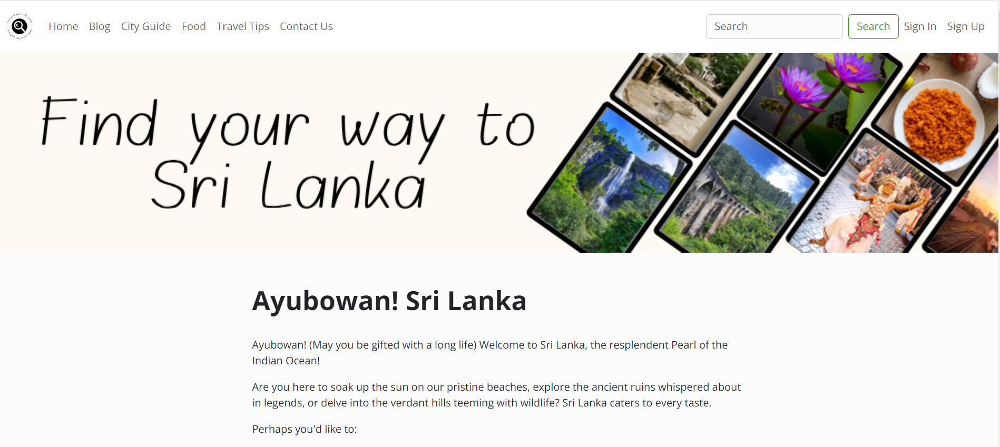

# Find Your Way to Sri Lanka

## Code Institute - Fourth Milestone Project: Full-Stack Toolkit Portfolio Project

This website showcases my ability to build a Full-Stack site, demonstrating business logic used to manage a centrally-owned dataset.

Sri Lanka, the "Pearl of the Indian Ocean," is known for its stunning beaches, ancient heritage, and affordability. This blog serves as a gateway to exploring Sri Lanka's hidden gems, from lush rainforests to forgotten temples, providing practical tips and insights for an unforgettable, budget-friendly adventure.

## Table of Contents
- [Demo](#demo)
- [UX](#ux)
- [User Stories](#user-stories)
  - [Strategy](#strategy)
  - [Scope](#scope)
  - [Structure](#structure)
  - [Skeleton](#skeleton)
  - [Surface](#surface)
- [Technologies](#technologies)
- [Features](#features)
  - [Existing Features](#existing-features)
  - [Features Left to Implement](#features-left-to-implement)
- [Testing](#testing)
  - [Bugs](#bugs)
- [Deployment](#deployment)
- [Credits](#credits)
  - [Content](#content)
  - [Media](#media)
  - [Acknowledgements](#acknowledgements)

## Demo

A live demo of the website can be found [here](https://portfolio-project4-blog-5ce2c6935f38.herokuapp.com/).

## UX

The website targets three user groups: admins, registered users, and visitors. It emphasizes simplicity and ease of navigation, focusing on blog articles related to Sri Lanka.

## User Stories

The goal of this site is to secure the travel blog, allowing users to create profiles, share adventures through posts with photos, and interact with content. Users can search for and discover destinations based on keywords, locations, or trends, while admins manage users and curate featured content.

### User Management

1. **User Profile Creation**
   - Users can register with their email, username, and password.
   - Users can edit their profile picture, name, bio, and travel interests.
   - User profiles are publicly accessible and display basic information.

2. **Admin User Management**
   - Admins can view, search, edit, suspend, or delete user accounts.

### Content Creation and Sharing

1. **Creating Blog Posts**
   - Users can create new blog posts with a title, description, and content using an editor.
   - Users can upload photos to be embedded in the blog post.
   - Users can choose categories and tags for their blog posts.

2. **Interacting with Content**
   - Users can like, comment on, and share other users' blog posts.

### Search and Discovery

1. **Searching for Blog Posts**
   - Users can search for blog posts by keyword, location, activity, or other criteria.
   - Users can filter search results by date, popularity, or other criteria.

2. **Discovering New Content**
   - The homepage displays featured blog posts chosen by admins.
   - Users can see trending topics and popular locations based on engagement.

### Strategy

The blog aims to foster a community through user-generated travel stories and photos. It helps users discover new destinations and budget-friendly adventures through search, trending topics, and curated content.

### Scope

The site focuses on user-generated content, allowing profile creation, blog posts, and interaction. It includes search and discovery functionalities, with admins managing users and curating content.

### Structure

The site follows a traditional web structure with a top navigation bar for easy access. It includes:

- **Content Types**: City Guide, Food, Travel Tips (static pages), and a Contact Us page with database storage.
- **Blog**: User-generated posts with like, dislike, and comment functionalities.
- **Admin Functionality**: Admins can delete blog posts.
- **Search**: Users can search blog posts by keyword.

**Website Sections:**
1. **Home**: Introduction to Sri Lanka, featured posts, and an image gallery.
2. **Blog**: Articles by users with like and comment options.
3. **City Guide**: Information about the best cities to visit.
4. **Food**: Popular food types to try.
5. **Travel Tips**: Useful travel advice.
6. **Contact Us**: A contact form connected to the database.
7. **Search**: Keyword-based search functionality.
8. **Sign In/Sign Up/Logout**: User authentication.
9. **My Profile/Create Profile/Edit Profile**: User is allowed to create a profile.
10. **Footer**: Contains copywriting and social media links.

### Skeleton

The website is designed with a clear, hierarchical flow.

- **Flow Chart**: 
- **Wireframe**: [View Wireframe (PDF)](static/readme-assets/wireFrame.pdf)
- **Entity Relationship Diagram**: [View ERD (PDF)](static/readme-assets/ERD.pdf)

### Surface

The design uses a white background for readability, brown shades for banners, gray text, and red for call-to-action buttons. The footer is in a darker color to differentiate it from the main content.

## Technologies

1. **HTML** - For basic site structure.
2. **CSS** - For styling and user experience.
3. **ElephantSQL** - For database management.
4. **Django** - Backend framework for building the site.
5. **Heroku** - For deployment and hosting.
6. **Balsamiq** - For wireframe design.

## Features

### Existing Features

- **Navigation Bar**: Provides links to various pages and user authentication options.  
      

- **Home**: Introduces Sri Lanka and showcases featured posts.  
            

- **Blog**: Displays articles with like and comment options.  
      

- **City Guide**: Information on top cities.  
      

- **Food**: Information on popular foods.  
      

- **Travel Tips**: Useful travel advice.  
      

- **Contact Us**: Contact form with database integration.  
      

- **Search**: Allows users to search blog posts.  
      

- **Sign Up/Sign In/Sign Out**: User registration and authentication.  
            

- **My Profile**: Users can create their profile and edit it as needed.  
            

- **Add Article**: Admins can create new articles.  
         

- **Like/Unlike**: Users can like and unlike posts.  
      

- **Comment**: Registered users can comment on posts.  
      

- **Footer**: Contains copywriting and social media links.  
      

### Features Left to Implement

- Edit profile page.
- Tags for articles.
- Share option for articles.

## Testing

- Verified site functionality across browsers (Chrome, Firefox, Edge) and mobile devices.
- Confirmed responsiveness using device toolbars.
- Ensured forms work correctly, with data saved in the database.

### Bugs

- **Solved Bugs**
  - CSRF validation issues resolved by adding `CSRF_TRUSTED_ORIGINS` to settings.
  - Static file issues fixed by creating a static directory and updating `settings.py`.
  - Deployment issues on Heroku resolved by rebuilding the project.
  - Issue with the edit profile page connection to the database resolved by manually creating the `user_profile` table.

## Deployment

The project was deployed using Heroku:
1. Clone the repository.
2. Create a new Heroku app.
3. Link the Heroku app to the GitHub repository.
4. Click on Deploy.

## Credits

### Content
- Error handling assistance from [Stack Overflow](https://stackoverflow.com/questions/38841109/csrf-validation-does-not-work-on-django-using-https).
- Site layout from [Bootswatch](https://bootswatch.com/) and [Bootstrap](https://getbootstrap.com/docs/5.0/components/navbar/).
- Blog comments implementation from [Codemy](https://www.youtube.com/watch?v=OuOB9ADT_bo).
- Blog content generated using Google Gemini AI.

### Media
- Background images from [Pixabay](https://pixabay.com) and [Pexels](https://pexels.com).

### Acknowledgements
- Code Institute's Full Stack Toolkit Portfolio Project for ideas and structure.
- Code Institute tutor support team for guidance.
- Grammar and spelling corrections by QuillBot.
- Mentor Medale Oluwafemi for invaluable guidance.
``